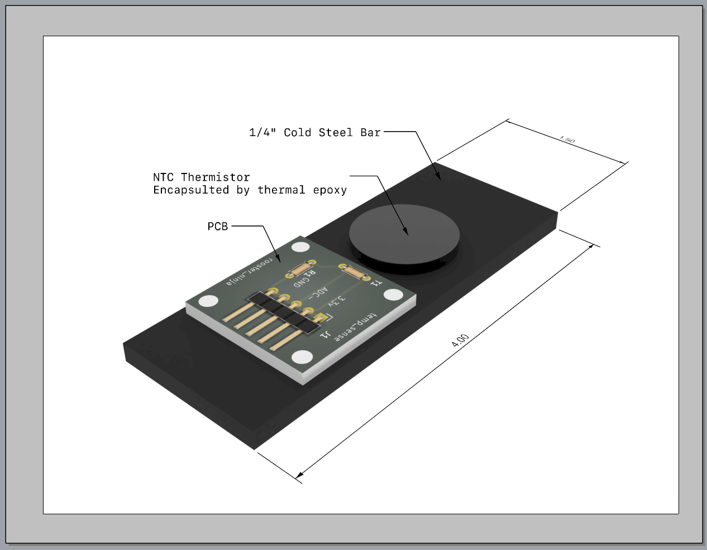
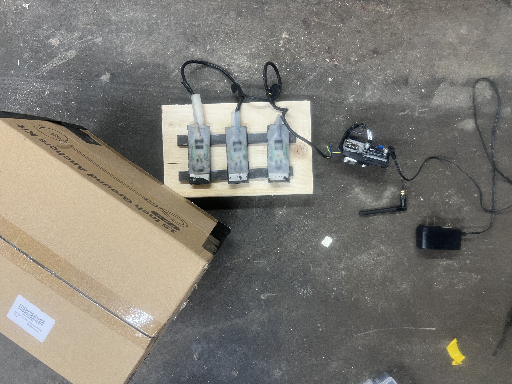
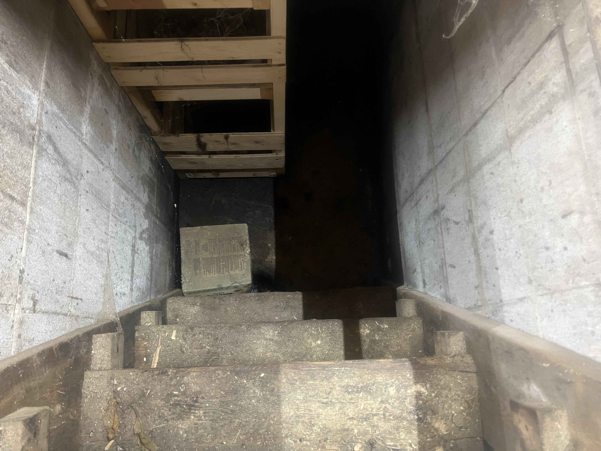
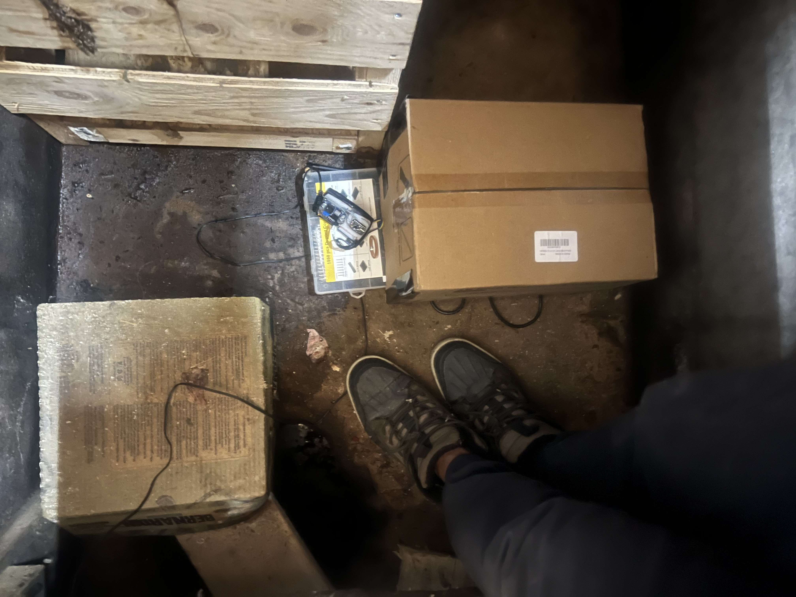

<p align="center">
  
</p>

<h1 align="center">Moon Temp Calibration</h1>

<p align="center">
  Multi-day sensor offset analysis and temperature calibration for a three-channel NTC thermistor array deployed in an 8-foot concrete static chamber.
</p>

---

## Overview

This notebook documents the full calibration workflow for `moon_temp_ads1115` — an ESP32-C3 firmware that reads three MF58 NTC thermistors via an ADS1115 16-bit ADC and publishes data over MQTT.

The sensors are thermal-epoxied to cold steel bars and deployed at the bottom of an **8-foot deep concrete pit**, providing a high-thermal-mass static environment for stable long-term temperature measurement.

| | |
|---|---|
| **Sensor** | MF58 10 kΩ NTC, B = 3950 K |
| **Circuit** | VCC 3.3 V → 10 kΩ fixed → ADS1115 → NTC → GND |
| **ADC** | ADS1115, ±4.096 V PGA, 128 SPS, 0.125 mV/LSB |
| **Resolution** | ~55 m°C per count at 26°C |
| **Static chamber** | 8 ft deep concrete pit |

## Hardware



Three NTC thermistors individually thermal-epoxied to 4″ × 1.5″ × ¼″ cold steel bars, mounted on a wooden carrier board with the ESP32-C3 and power supply.

<table>
<tr>
<td></td>
<td></td>
<td></td>
</tr>
<tr>
<td align="center"><em>Bench setup</em></td>
<td align="center"><em>8 ft concrete pit</em></td>
<td align="center"><em>In-situ deployment</em></td>
</tr>
</table>

## Notebook Contents

| Part | Description |
|---|---|
| **Part 1** | Load May 26 baseline data, raw overview |
| **Part 2** | Cross-correlation analysis — per-channel offsets derived |
| **Part 3** | May 27 verification after first offset attempt |
| **Part 4** | Heat response test — hand-grip liveness check, sequential ADC0→1→2 |
| **Part 5** | May 26–29 progression — offset correction history |
| **Part 6** | Temperature conversion — Beta equation, °C summary, multi-day chart |

## Calibration Summary

| Date | Event | adc0−adc1 median | adc0−adc2 median |
|---|---|---|---|
| May 26 | Baseline (no offset) | +7 counts | −33 counts |
| May 27 | First offset attempt (`adc1: -63, adc2: -71`) | −25 counts | −193 counts |
| May 28 | Corrected offset (`adc1: +95, adc2: +7`) | +95 counts | +7 counts |
| May 29 | Post-correction | **0 counts** ✓ | −16 counts |

Final inter-sensor spread on May 29: **< 0.05°C mean** across all three channels.

## Temperature Conversion

Using the Beta equation:

```
V      = counts × 0.125 mV
R_ntc  = V × 10,000 / (3.3 − V)
T (K)  = 1 / (1/298.15 + (1/3950) × ln(R_ntc / 10000))
T (°C) = T (K) − 273.15
```

Modal ADC reading of 12,784 counts → **~26.4°C**.

## Firmware

Sensor firmware: [`rooster-ninja/moon_temp_ads1115`](https://github.com/rooster-ninja/moon_temp_ads1115)

Offsets are applied on-device via `saturating_add` and persisted to flash — survives reboots. Send corrections over MQTT:

```bash
mosquitto_pub -h <broker> -t moon-temp-001/offset/cmd -m '{"adc":1,"offset":95}'
mosquitto_pub -h <broker> -t moon-temp-001/offset/cmd -m '{"adc":2,"offset":7}'
```

## License

MIT
